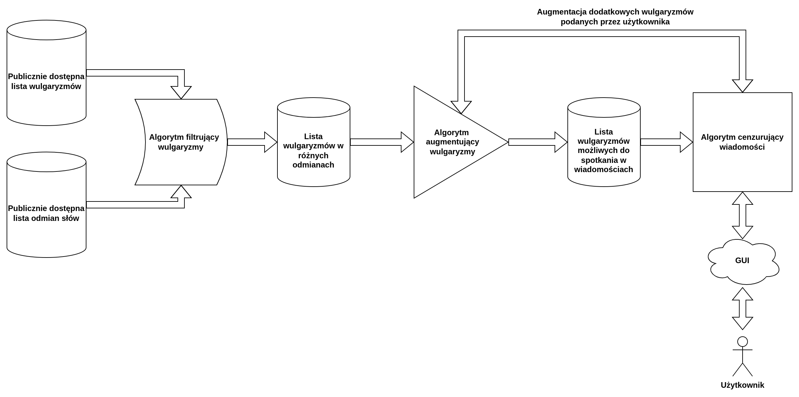

# PG-Hackaton-2022-Pretest

## Instalacja i obsługa programu

W celu instalacji programu zainstalować należy wcześniej następujące oprogramowanie:

- [Git](https://git-scm.com/) - w celu pobrania repozytorium kodu.
- [Python3](https://www.python.org/) z PIP - w wersji >= 3.7 - do wykonania kodu projektu.

Następnie utworzyć należy folder, w którym znajdować ma się projekt i otworzyć terminal ze ścieżką roboczą ustawioną jako ten folder.
W terminalu należy wykonać następującą komendę:

```bash
pip install -r requirements.txt
```

Zainstaluje ona wszystkie niezbędne zależności.
Następnie, projekt uruchomić można za pomocą:

```bash
streamlit run gui.py
```

Komenda ta powinna automatycznie otworzyć stronę internetową, z której poziomu obsłużyć można program.

## Zasada działania programu

Architektura naszego rozwiązania, opisana została na poniższym schemacie:

